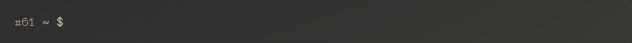

# My Dotfiles

## My main configuration files:

- fonts in .fonts are mostly fonts for [powerline](https://github.com/powerline/fonts) support
- konsole contains my konsole themes and profile (lives in `$HOME/.local/share/konsole`)
- plasma contains my _keybindings_, _window rules_ (can be imported through settings GUI)
- icons contains [papirus](https://github.com/PapirusDevelopmentTeam/papirus-icon-theme) icons edited to match gruvbox style _(see my topbar screenshot)_
- package_data contains some of my archlinux packages
- spotify contains my spotify theme (with gruvbox colorscheme), you will need [oomox](https://github.com/actionless/oomox) installed, then run the script inside

## .config files (Mainly files for [bspwm](https://github.com/baskerville/bspwm) + [sxhkd](https://github.com/baskerville/sxhkd) + [polybar](https://github.com/jaagr/polybar) + [Compton](https://github.com/chjj/compton))
- Code contains my _user settings_, _keyboard shortcuts_ and a _list of installed extensions_
- rofi directory used for [rofi](https://github.com/DaveDavenport/rofi) - see my custom [rofi launch script for Plasma](.bash/scripts/rofi-blurred)
- zathura directory with gruvbox colorstyle for zathura copied from [abdullaev](https://github.com/abdullaev/dotfiles/blob/master/.config/zathura/zathurarc)
- css directory contains css themes (currently only whatsapp copied from [this](https://userstyles.org/styles/142096/dark-whatsapp-theme-by-mew) and changed colors to match the gruvbox colorscheme)

Most of my files are set with the [gruvbox](https://github.com/morhetz/gruvbox) colorscheme.

## Installation and Cloning

This repository contains submodules for the vim extensions, therefore you have to clone the submodules for vim to work correctly. Do either:

`git clone --recurse-submodules -j8 [this-repo-url]`

where -j8 is the number of jobs to run in paralell. Or:

```
git clone [this-repo-url]
git submodule init
git submodule update
```

A script is provided to link the files. Run `install_my_config.sh --help` for its usage.


## Screenshots

### Prompt 1


### Prompt 2


### Prompt 3


### Prompt 4


### Prompt 5


### Prompt 6


### Prompt 7




These prompts are in the order that i made them so the last ones are improved.

Prompts support:

- git directories and status of the files (untracked, staged... aswell as upstream checks), but you must source `.bash/git-prompt.sh`
- diferent colors for normal user / root / ssh session user (in **prompt 6, 7** this segment is hidden unless the user is root or in an ssh session)
- python virtual environments. **except prompt 1**
- last command exit status ( failed or succeded )
z,s
- compress some paths ( my repository path is compressed into "R:" . **except prompt 5, 6, 7**
- background jobs counter
- command counter **only prompt 5, 6, 7**
- show the respective tty. **except 6, 7**
- display virtual machine environment indicator **only prompt 7**

**NOTE**: The readline input mode can be changed with `CTRL+E` from vim-comand directly into emacs and is displayed at the beginnig of the prompt:

 

## vim plugins (using [Vundle](https://github.com/VundleVim/Vundle.vim))

 - [vim-airline](https://github.com/vim-airline/vim-airline)
 - [nerdtree](https://github.com/scrooloose/nerdtree)
 - [nerdtree-git-plugin](https://github.com/Xuyuanp/nerdtree-git-plugin)
 - [vim-gitgutter](https://github.com/airblade/vim-gitgutter)
 - [vim-fugitive](https://github.com/tpope/vim-fugitive)
 - [vim-surround](https://github.com/tpope/vim-surround)
 - [vim-commentary](https://github.com/tpope/vim-commentary)
 - [vim-numbertoggle](https://github.com/jeffkreeftmeijer/vim-numbertoggle)
 - [gundo.vim](https://github.com/sjl/gundo.vim)
 - [vim-easymotion](https://github.com/easymotion/vim-easymotion)
 - [linediff.vim](https://github.com/AndrewRadev/linediff.vim)
 - [vim-tmux-focus-events](https://github.com/tmux-plugins/vim-tmux-focus-events)
 - [vim-tmux-clipboard](https://github.com/roxma/vim-tmux-clipboard)
 - [vim-ps1](https://github.com/PProvost/vim-ps1)
 - [python-syntax](https://github.com/vim-python/python-syntax)
 - [vim-auto-origami](https://github.com/benknoble/vim-auto-origami)
 - [gruvbox](https://github.com/morhetz/gruvbox)

## Vim (gruvbox theme) screenshots

_tabline and status bar are hidden on startup in my current configuration, they can be shown again with `<leader>+a`_


## Tmux (Powerline Theme / Clean theme )


.tmux contains parts from [tmux-powerline](https://github.com/erikw/tmux-powerline)

Themes can be switched by changing the theme name on [.tmux-powerlinerc](.tmux-powerlinerc) and adjust the [.tmux.conf](.tmux.conf) in the lines marked with _FOR POWERLINE_

## Spotify

customized using [oomox](https://github.com/actionless/oomox) and my [customize spotify](spotify/customize_spotify.sh) script

## Others
- .xDefaults used for urxvt
- .gdb-dashboard.py can be used as .gdbinit (by renaming it to .gdbinit) since this depends on [pwndbg](https://github.com/pwndbg/pwndbg)
- .bash, .bashrc, .bash_profile, .inputrc used for bash and readline configuration

### My other themes to go along with the gruvbox colorscheme
 - [GTK](https://github.com/3ximus/gruvbox-gtk)
 - [Plasma](https://github.com/3ximus/gruvbox-plasma)
 - [VS Code](https://github.com/jdinhlife/vscode-theme-gruvbox)


## More Screenshots

I use [quarter-tiling](https://github.com/Jazqa/kwin-quarter-tiling) KWin script for window tiling


vim, htop and ranger (all in tmux sessions)


firefox, dolphin and visual studio code


rofi (launched with [.bash/scripts/rofi-blurred](.bash/scripts/rofi-blurred))


plasma top bar

