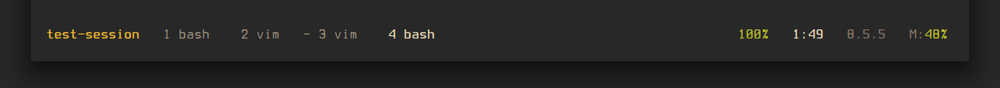

# My Dotfiles

## My main configuration files:

- firefox contains my stylish.sqlite file for [stylish](https://addons.mozilla.org/en-US/firefox/addon/stylish/) addon
- fonts in .fonts are mostly fonts for [powerline](https://github.com/powerline/fonts) support
- vscode contains my user settings, keyboard shortcuts and a list of installed extensions
- konsole contains my konsole themes and profile (lives in $HOME/.local/share/konsole)
- plasma contains my keybindings, window rules (can be imported through settins GUI) and icons to match my theme (edited from [papirus](https://github.com/PapirusDevelopmentTeam/papirus-icon-theme))
- package_data contains some of my archlinux packages
- spotify contains my spotify theme (with gruvbox colorscheme), you will need [oomox](https://github.com/actionless/oomox) installed, then run the script inside

Some of my files are set with the [gruvbox](https://github.com/morhetz/gruvbox) colorscheme.

## Screenshots

### Prompt 1

### Prompt 2

### Prompt 3

### Prompt 4

### Prompt 5

### Prompt 6

These prompts are in the order that i made them so the last ones are improved.

Prompts support:

- git directories and status of the files (untracked, staged... aswell as upstream checks), but you must source `.bash/git-prompt.sh`
- diferent colors for normal user / root / ssh session user (in **prompt 6** this segment is hidden unless the user is root or in an ssh session)
- python virtual environments. **except prompt 1**
- last command exit status ( failed or succeded )
- compress some paths ( my repository path is compressed into "R:" . **except prompt 5, 6**
- background jobs counter
- command counter **only prompt 5, 6**
- show the respective tty. **except 6**

## vim plugins (using [Vundle](https://github.com/VundleVim/Vundle.vim))

- [vim-airline](https://github.com/vim-airline/vim-airline)
- [vim-fugitive](https://github.com/tpope/vim-fugitive)
- [nerd-tree](https://github.com/scrooloose/nerdtree)
- [vim-gitgutter](https://github.com/airblade/vim-gitgutter)
- [vim-surround](https://github.com/tpope/vim-surround)
- [vim-goyo](https://github.com/junegunn/goyo.vim)
- [vim-commentary](https://github.com/tpope/vim-commentary)

## Vim (hybrid theme) / GVim (gruvbox theme) screenshots

## Tmux

## Spotify

## Others

- .xDefaults used for urxvt
- .xResources used for [rofi](https://github.com/DaveDavenport/rofi)
- .tmux contains parts from [tmux-powerline](https://github.com/erikw/tmux-powerline)
- .gdb-dashboard.py can be used as .gdbinit (by renaming it to .gdbinit) since this depends on [pwndbg](https://github.com/pwndbg/pwndbg)
- .bash, .bashrc, .bash_profile, .inputrc used for bash and readline configuration

### My other themes to go along with the gruvbox colorscheme
 - [GTK](https://github.com/3ximus/gruvbox-gtk)
 - [Plasma](https://github.com/3ximus/gruvbox-plasma)
 - [Firefox](https://github.com/3ximus/gruvbox-arc-firefox-theme)
 - [VS Code](https://github.com/jdinhlife/vscode-theme-gruvbox)

## More Screenshots

I use [this](https://github.com/Jazqa/kwin-quarter-tiling) tilling script for KWin

