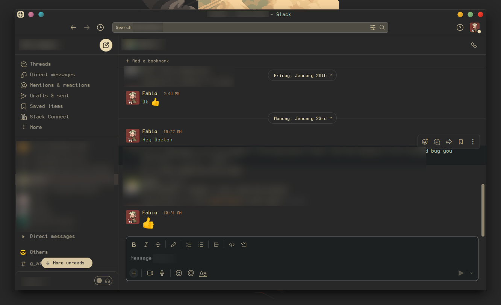

# My Dotfiles

## My main configuration files:

- [Dependencies](https://github.com/3ximus/dotfiles#dependencies)
- [Installation/Cloning](https://github.com/3ximus/dotfiles#installation-and-cloning)
- [Vim](https://github.com/3ximus/dotfiles#vim)
- [Tmux](https://github.com/3ximus/dotfiles#tmux)
- `.bashrc` only contains some bash options and sources all scripts inside [.bash](https://github.com/3ximus/dotfiles/tree/master/.bash), which contains:
    - [prompts](https://github.com/3ximus/dotfiles#prompts)
    - [functions](https://github.com/3ximus/dotfiles/blob/master/.bash/functions.sh) and [aliases](https://github.com/3ximus/dotfiles/blob/master/.bash/aliases.sh)
    - `ble.sh` contains [ble.sh](https://github.com/akinomyoga/ble.sh), which is a new readline implementation and it's simply amazing! There is also `blerc` which contains custom settings and themes to make blesh suit my preferences...
    - [fzf-bindings.bash](https://github.com/junegunn/fzf/blob/master/shell/key-bindings.bash) for fzf bindings that defines some custom bindings through ble.sh. And [fzf-marks-plugin.sh](https://github.com/urbainvaes/fzf-marks) for directory marks with fzf which saves a lot of typing :)
    - [fzf-git.bash](https://github.com/3ximus/dotfiles/blob/master/.bash/fzf-git.bash) contains some functions to use fzf with git. There are some better projects with these
    - `scripts` with some useless utilities that I didn't want to create as a function...
- `inputrc` contains some bindings for bash readline that are accepted in `ble.sh` too. I use this file for more barebones configs that I don't want running `ble.sh`
- `.gitconfig` with my configuration for git (uses [delta](https://github.com/dandavison/delta#used-by-delta) to view diffs)
- fonts in .fonts are from [powerline](https://github.com/powerline/fonts)  and [nerd fonts](https://github.com/ryanoasis/nerd-fonts)
- [konsole](https://github.com/3ximus/dotfiles/tree/master/konsole) contains my konsole themes and profile (lives in `$HOME/.local/share/konsole`)
- [icons](https://github.com/3ximus/dotfiles/tree/master/icons) contains [papirus](https://github.com/PapirusDevelopmentTeam/papirus-icon-theme) icons edited to match gruvbox style (there is a script inside to install these icons)
- [css](https://github.com/3ximus/dotfiles/tree/master/css) contains styles to inject somewhere
- `.gdbinit` contains a dashboard from [gdb-dashboard](https://github.com/cyrus-and/gdb-dashboard) that takes gdb out of the dark ages.
- `custom.layout.latte` contains [latte-dock](/etc/update-manager/release-upgrades.) configuration


- *Files inside `.config`*
    - [bottom](https://github.com/ClementTsang/bottom) and `htop` configs
    - [ranger](https://github.com/ranger/ranger) configs. The `scope.sh` inside it is also used by `fzf` to preview files if it exists. Which makes not sense but I didn't bother to place it better where it can be used by both programs...
    - [rofi](https://github.com/DaveDavenport/rofi) with a custom colorscheme, that I use in [rofi launch script for Plasma](.bash/scripts/rofi-blurred) to look like [this](https://github.com/3ximus/dotfiles/blob/master/screenshots/rofi.png) and bind a key to something like this `$HOME/.bash/scripts/rofi-blurred.sh -show run`
    - `zathura` directory with gruvbox colorstyle for zathura copied from [abdullaev](https://github.com/abdullaev/dotfiles/blob/master/.config/zathura/zathurarc)
    - other old files for the combo: [bspwm](https://github.com/baskerville/bspwm) + [sxhkd](https://github.com/baskerville/sxhkd) + [polybar](https://github.com/jaagr/polybar) + [Compton](https://github.com/chjj/compton). Now I just use `plasma` for mental health reasons...

Most of my files are set with the [gruvbox](https://github.com/morhetz/gruvbox) colorscheme that is the only one I don't get tired of...

## Dependencies

 - `gawk` for building ble.sh
 - `fzf` for some keybindings and bookmark directories in bash
 - `delta` for generating git diffs (setup in `.gitconfig`) [delta](https://github.com/dandavison/delta#used-by-delta)

## Installation and Cloning

This repository contains submodules for the `ble.sh`, `vim-plug` and `Tmux Plugin Manager`. Do either:

`git clone --recurse-submodules -j8 https://github.com/3ximus/dotfiles.git`

where -j8 is the number of jobs to run in paralell. Or:

```
git clone https://github.com/3ximus/dotfiles.git
git submodule init
git submodule update
```

 **NOTE** To configure the first time you need to run make inside `.bash/ble.sh` (this is where the `gawk` dependency comes in)

To update the vim plugins and the repo use

```
git pull --recurse-submodules -j8
```

If new submodules where added you might need to run `git submodule init` again

To copy/link the files you want run `install_my_config.sh --help` to check the usage of this script

## Prompts

### Current prompt:


Other prompts are available and can be set with the function `prompt [1-7]`, or directly source one of the files inside [prompts](https://github.com/3ximus/dotfiles/tree/master/.bash/prompts)

Prompts support:

- git directories and status of the files (untracked, staged... aswell as upstream checks), but you must source `.bash/git-prompt.sh`
- diferent colors for normal user / root / ssh session user (in **prompt 6, 7** this segment is hidden unless the user is root or in an ssh session)
- python conda/virtual environments. **except prompt 1**
- last command exit status ( failed or succeded )
z,s
- compress some paths ( my repository path is compressed into "R:" . **except prompt 5, 6, 7**
- background jobs counter
- command counter **only prompt 5, 6, 7**
- show the respective tty. **except 6, 7**
- display virtual machine environment indicator **only prompt 7**

## Vim

To install all the vim plugins open vim and run `:PluginInstall`

Vim configuration is huge but it's organized and documented, so just open the `.vimrc` file and check it out

### Plugins (using [vim-plug](https://github.com/junegunn/vim-plug)):

Check the `.vimrc` on the `VIM PLUG PLUGINS` section for the list of plugins


## Tmux

To install the tmux plugins press `<prefix>+I` (it will freeze for a few seconds...)


Tmux has a lot of custom configurations added in `.tmux.conf` and a few plugins inside `.tmux` added as submodules that are managed through [TPM (Tmux Plugin Manager)](https://github.com/tmux-plugins/tpm)

 - [tmux-prefix-highlight](https://github.com/tmux-plugins/tmux-prefix-highlight)
 - [tmux-fingers](https://github.com/morantron/tmux-fingers)
 - [tmux-battery](https://github.com/tmux-plugins/tmux-battery)
 - [tmux-plugin-uptime](https://github.com/3ximus/tmux-plugin-uptime)
 - [tmux-plugin-datetime](https://github.com/3ximus/tmux-plugin-datetime)
 - [tmux-suspend](https://github.com/MunifTanjim/tmux-suspend)

## Firefox

I've used [firefox color](https://color.firefox.com/?theme=XQAAAAKOAgAAAAAAAABBqYhm849SCicxcUHkAiuG_ebZUZXOFqt9j8_9G63umOx1Kzjw7Cy1V9l2m-eZCjY_-24JBu_QklSG5xinXnzntyleAjqG3EsmVf5BGg4AmWSyU_xAoGCxzXEfOaGTXe_p7BplC1mvfb0GJQQlB6r2_HMAGaqaaiElrS53dEb0J8Lfv20NSdqRq68iXu8XnsFWPnUhq8cZmevaOB7FNtYws1_se_EkH_e-v_pbpM8CBqIpli0i6SHIiEicmHi0jVWFAAC-d4NsoXQgKXmL7IG_NPxk9ZrkwnXnS0qqTvxFxuX0KqLdUEG3Jclm_Xb3XPP4KKzFDyyWleslqpZ3NzQlQSvKQRWWok0GjEWwIHcQ4G8EsRea41HmGmi_tX-UTmoYnS6toh3_5Rg24A) in the past but it's not able to theme everything. So I've made my own custom theme and got it [signed](https://addons.mozilla.org/en-US/developers/addon/cff3d1277a2f4f289b5f/versions/5520800): `firefox/gruvbox-dark-cyan.zip`. I also have some custom tweaks on `firefox/userChrome.css` and custom developer tools theme on `firefox/userContent.css`

## Slack


My slack style hack with the following sidebar settings:

```
#282828,#232527,#3C3836,#EBDBB2,#3C3836,#EBDBB2,#EBDBB2,#3C3836,#282828,#EBDBB2
```

## Spotify

My spotify modified [Matte](https://github.com/spicetify/spicetify-themes/tree/master/Matte) theme to use with [spicetify](https://github.com/spicetify/spicetify-cli)


# [Icons](https://github.com/SylEleuth/gruvbox-plus-icon-pack)

### Older themes to go along with the gruvbox colorscheme
 - [GTK](https://github.com/3ximus/gruvbox-gtk)
 - [Plasma](https://github.com/3ximus/gruvbox-plasma)
 - [VS Code](https://github.com/jdinhlife/vscode-theme-gruvbox)
 - [WhatsApp](https://github.com/3ximus/gruvbox-dark-whatsapp)
