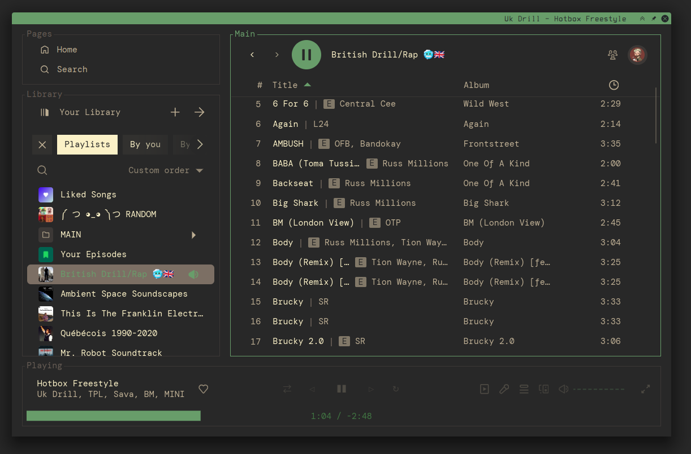

# Spicetify themes

This is meant to be used with spicetify

```
./spicetify restore backup apply
```

My `~/.config/spicetify/config-xpui.ini` file:

```ini
[AdditionalOptions]
extensions            =
custom_apps           =
sidebar_config        = 1
home_config           = 1
experimental_features = 1

[Patch]

[Setting]
spotify_path            = /usr/share/spotify/
replace_colors          = 1
overwrite_assets        = 1
check_spicetify_upgrade = 0
prefs_path              = /home/eximus/.config/spotify/prefs
current_theme           = Matte
color_scheme            = gruvbox
inject_css              = 1
spotify_launch_flags    =
inject_theme_js         = 1

[Preprocesses]
remove_rtl_rule       = 1
expose_apis           = 1
disable_upgrade_check = 1
disable_sentry        = 1
disable_ui_logging    = 1

; DO NOT CHANGE!
[Backup]
version = 1.2.8.923.g4f94bf0d
with    = 2.17.2
```



